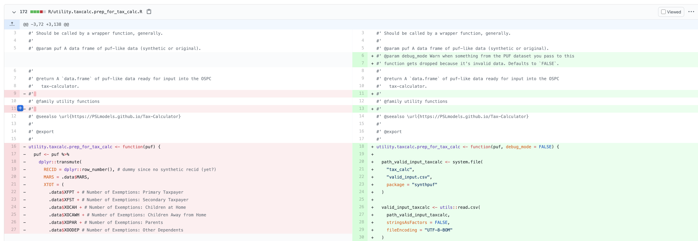
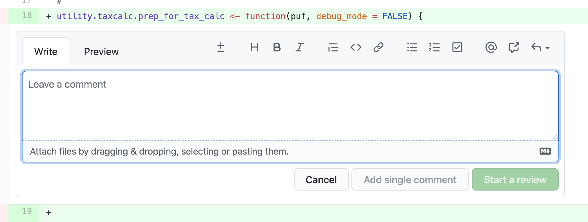
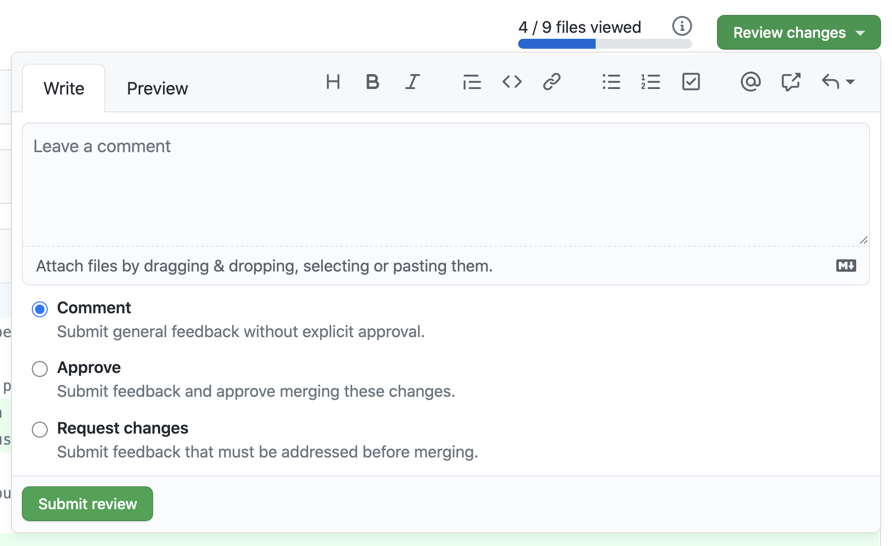

# Boosting Upward Mobility from Poverty

This repository contains code to construct 26 county-level metrics across 9 domains that broadly measure mobility from poverty. To learn more please read

* [Boosting Upward Mobility: Metrics to Inform Local Action](https://www.urban.org/research/publication/boosting-upward-mobility-metrics-inform-local-action)
* [Boosting Upward Mobility: Metrics to Inform Local Action Summary](https://www.urban.org/research/publication/boosting-upward-mobility-metrics-inform-local-action-summary)

Detailed documentation of code and data is available [here](https://ui-research.github.io/mobility-from-poverty/documentation/overview).

# Motivation

The objective of this repository is to make all results reproducible, to document processes and assumptions, and to make it easier for analysts to produce metrics in future years. A little extra effort today can make a big difference in the future. For more motivation, please read the motivation for a style guide by  [Michael Stepner](https://github.com/michaelstepner/healthinequality-code/tree/master/code#motivation). If that isn't enough, read the section on [technical debt](https://github.com/michaelstepner/healthinequality-code/blob/master/code/readme.md#technical-debt).

This guide is a work-in-progress. If there are any ambiguities or unresolved questions, please contact [Aaron R. Williams](awilliams@urban.org). 

# Table of Contents

* [Repository Contents](#repository-contents)
* [File Descriptions](#file-descriptions) 
    * [Recent File](#recent-file)
    * [Multi-Year File](#multi-year-file)
    * [Variables](#variables)
* [Project Organization](#project-organization)
* [GitHub](#github)
    * [GitHub Standards](#github-standards)
    * [Github Basic](#github-basics)
    * [GitHub Workflow](#github-workflow)
* [Data Standards](#data-standards)
    * [Joining Variables](#joining-variables)
    * [Values](#values)
    * [Sorting](#sorting)
    * [Standard Errors](#standard-errors)
    * [Quality Flags](#quality-flags)
    * [Data Dictionary](#data-dictionary)
    * [Subgroups File Structure](#subgroups-file-structure)
* [Code Standards](#code-standards)
    * [Subgroups Code](#subgroups-code)
* [Code and technical Review](#code-and-technical-review)
    * [Scope of the Review](#scope-of-the-review)
    * [How to Prepare for a Code Review](#how-to-prepare-for-a-code-review)
    * [Code Reviews in GitHub](#code-reviews-in-github)
    * [Code Branching for Reviewers](#code-branching-for-reviewers)
* [Creating the Final File](#creating-the-final-file)
* [License](#license)
* [Contact](#contact)

# Repository Contents

| Domain                  |      Metrics      |
|:-------------------------|:-------------|
| 01_financial-well-being | Income <br/> Financial security  | 
| 02_housing              | Affordable housing <br/> Housing instability and homelessness |
| 03_family               | Family structure and stability  |
| 04_health               | Access to and utilization of health services <br/> Neonatal health  |
| 05_local-governments    | Political participation  |
| 06_neighborhoods        | Economic inclusion <br/> Racial diversity <br/> Transportation access <br/> Environmental quality  |
| 07_safety               | Exposure to crime <br/> Overly punitive policing  |
| 08_education            | Access to preschool <br/> Effective public education <br/> Student poverty concentration <br/> College readiness |
| 09_employment           | Employment <br/> Access to jobs paying a living wage  |

# File Description

## Recent Files

* The recent county file has exactly one row per county and contains the most recent year for each of the mobility metrics. This file should have exactly 3,142 observations and contain missing values where metrics were unavailable or not computed.
* The recent city file has one row per census place and contains the most recent year for each of the mobility metrics. This file should have 486 observations and contain missing values where metrics were unavailable or not computed.

## Multi-Year Files

* The multi-year county file contains one observations per county per year. It contains missing values where metrics are unavailable or have not been computed. This file should have about 3,142 observations per year. 
* The multi-year city file contains one observations per large city per year. It contains missing values where metrics are unavailable or have not been computed. This file should have about 486 observations per year. 

## Subgroups Files

* The subgroups county files contains multiple observations per county per year. The file is long and the multiple observations per county per year are for subgroups like race/ethnicity and poverty status.
* The subgroups city file contains multiple observations per census place per year. The file is long and the multiple observations per census place per year are for subgroups like race/ethnicity and poverty status.

# Project Organization

* Each domain should have its own directory. The name of the directory should only contain lower case letters, numbers, and hyphens. Do not include spaces. 
* The [overview documentation file](https://github.com/UI-Research/mobility-from-poverty/blob/main/documentation/overview.md) includes information about the metrics. It should contain clear instructions for running the code. It should contain a brief list of the assumptions and methodology used to create each metric.
* Avoid absolute file paths. If using R, use `.Rproj`. If using Stata, use projects. Otherwise, set the working directory. This ensures that the code is portable. 
* **Only add final data to the repository.** Each subfolder should contain a `data/` folder for intermediate data files. The `data/` folder should be added to the `.gitignore`. The final file should be added to GitHub. 
* If possible, download your data with code or pull your data from an API with code. 
* **Do not include any credentials in the repository.** Please reach out to [Aaron R. Williams](awilliams@urban.org) if this creates issues. 
* Use names that play well with default ordering (e.g. 01, 02 and YYYY-MM-DD dates) for directory and file names.

# GitHub

## GitHub Standards

* Do not work on the `main` branch. 
* **Only add final data to the repository.** Each subfolder should contain a `data/` folder for intermediate data files. The `data/` folder should be added to the `.gitignore`. The final file should be added to GitHub. 
* Regularly pull from the remote `main` branch to keep your local and remote branches up-to-date. Most merges will automatically resolve. [Here](https://docs.github.com/en/github/collaborating-with-issues-and-pull-requests/resolving-a-merge-conflict-using-the-command-line) are tips for resolving other merge conflicts. 
* The use of [GitHub issues](https://docs.github.com/en/github/managing-your-work-on-github/about-issues) is encouraged. 

## GitHub Basics

An Urban Institute-focused introduction to GitHub including installation instructions is available [here](https://ui-research.github.io/urbngit/). 

After installing Git and setting up a GitHub account, follow these steps to get started on Windows:

1. Right click and select "Git Bash Here" where you want to copy the repository (main folder) on your computer. 
2. Submit `git clone https://github.com/UI-Research/mobility-from-poverty.git`. You will need to enter your user email and password. Everything will then copy to your computer.
3. Close Git Bash. 
4. Enter the `gates-mobility-metrics` folder, right click, and select "Git Bash Here". 
5. Submit `git checkout -b aaron` but replace `aaron` with your name.

After this, you should be able to edit files and then add them to Git with the process outlined in the guide above. 

Email awilliams@urban.org if you have questions about working with Mac or Linux. 

## GitHub Workflow

1. Check out a branch with your first name in lowercase. Additional branching is allowed but merge all changes into your main branch.
2. Commit changes regularly with detailed commit messages. 
3. Regularly push your code to your remote branch on GitHub. 
4. To contribute to the `main` branch, put in a Pull Request. Tag Aaron R. Williams as a reviewer (@awunderground). Briefly describe what the PR does. 
5. Aaron R. Williams will review and incorporate changes into the `main` branch. He may ask you to make changes. 

**Please reach out Aaron with any questions.** The only thing he loves more than version control is helping people learn version control. 

# Data Standards

* All final files should be in the `.csv` format. The files should be delimited with a comma. 
* Files should have descriptive names about the metrics and only include lower case letters, numbers, and underscores (lower camel case, i.e. camel_case). Do not use spaces.
* Do not open and save any `.csv` files in Microsoft Excel. Excel defaults are not sensible and lead to analytic errors. 
* Important intermediate files should be added to Box. Final data files should be added to Box and the GitHub repository.
* FIPS codes should always contain leading zeros so that state codes are two digits, county codes are three digits, and place codes are five digits. 

### Joining variables

* The first three variables in every file should be `year`, `state`, and `county`/`place`. `year` should be a four digit numeric variable. `state` should be a two characters FIPS code. `county` should be a three character FIPS code. `place` should the 5-digit census place FIPS. Intermediate files at the tract-level should include `tract` as the fourth variable. `tract` should be a six character FIPS code. All geography variables should have leading zeros for ids beginning in zeros. 

The final combined subgroup dataset will contain a subset of metrics in the original/years dataset because not all metrics will be extended for subgroup analysis. The only variables in the second database that will not be in the first database will be `subgroup_type` and `subgroup`.  

`subgroup_type` will be `all`, `race-ethnicity`, or `income`. `subgroup` will be the name of the specific subgroup. These may differ some across metrics so we will need to converge on the appropriate names. The next section further addresses race/ethnicity.  

### Values

* Include all counties/cities even if a county is all missing values. Every join to the master file should be one-to-one within a year.
* Variable names should only include lower case letters, numbers, and underscores (lower camel case, i.e. camel_case). 
* Percentages should be stored as proportions between 0 and 1 inclusive with a leading zero. (75% should be 0.75)
* Missing values should be coded as empty cells.

Subgroups will depend on data availability and prioritization. For race, the objective is to pull "Black, Non-Hispanic", "Hispanic", "Other Races and Ethnicities", and "White, Non-Hispanic." If a subgroup lacks the precision to be responsibly reported, then report an `NA` and set the data quality to a 3. Do not combine groups such as “Other Races and Ethnicities” with “White, Non-Hispanic”.  

### Sorting

* All files should be sorted by `year`, `state`, and `county`/`place`, the first three variables in every file. Files at different geographic levels should be sorted by `year` and then in order by largest geographic level (i.e. state) to smallest geographic level (i.e. Census block). 
* Subgroup files should be sorted by `year`, `state`, `county`/`place`, `subgroup_type`, and `subgroup`. All sorting should be alphanumeric. Importantly, the race/ethnicity groups should be sorted alphabetically so that “Black, Non-Hispanic” appears first and “White, Non-Hispanic” appears last. 

### Standard Errors

* If possible, construct 95 percent confidence intervals for metrics. 
* Add confidence bounds as columns in the `.csv` files. The variables should have the suffixes `_lb` for lower bound and `_ub` for upper bound. 
* Do not include the `_lb` and `_ub` if a 95 percent confidence interval calculation isn't possible.

### Quality Flags

* Construct a "quality" flag for each constructed metric. Include it as a variable the suffix `_quality`. 
* All observations should receive one of the following three grades or a missing value. 

| Score | Description |
|-------|:----------|
| 1  |  The calculated metric for the observation is high-quality and there are no substantial concerns with measurement error, missingness, sample size, or precision.  | 
| 2  |    There are issues with the calculated metric for the observation but the issues are limited. It is ok for a community partner to look at the metric.     | 
| 3  | There are serious issues with the calculated metric for the observation. It is possible to calculate the metric but there are critical issues with measurement error, missingness, sample size, and/or precision. A community should not act on this information.  | 
|  | It was not possible to calculate a metric for the county or city. |

* Describe how you determined the grades in your methodology description. For example, observations with more than 20% missing values received a score of `3`. 

### Data Dictionary 

* We will construct a detailed data dictionary for users of the data. 
* Be sure to include information about the format of your metrics in the metric-specific READMEs. Completed metrics will be added to the [variables table](#variables) in this README.

### Subgroups File Structure

A new database with one observation per subgroup per county per year, so that metric values for subgroups are rows. This database will be in a long format and contain the "all" group. For example, if there are four subgroups then there should be 3,142x4 + 3,142x1 = 15,710 observations per year. This may seem foreign to some Stata and SAS programmers but it has several advantages.  

1. It limits the challenges in standardization of naming conventions and the number of variables. For example, imagine adding four subgroups in a wide format. This would mean adding four variables, four lower bounds, four upper bounds, and four quality metrics. In addition to being unwieldy, it would result in burdensome variable names (e.g. `share_debt_coll_nonhispanic_white_quality1). 
2. This format is [tidy](https://www.jstatsoft.org/article/view/v059i10) (Wickham, 2014) and has many appealing features for data analysis.  
3. The format will transfer better into the county-level data sheets we will need to produce for communities.  

# Code Standards 

* The [tidyverse style guide](https://style.tidyverse.org/) was written for R but contains lots of good language-agnostic suggestions for programming. 
* Use descriptive names for all variables, data sets, functions, and macros. Avoid abbreviations. 
* Include comments that state "why", not "what". Include comments for all assumptions. 
* Use ISO 8601 dates (YYYY-MM-DD).
* Write assertions and in-line tests. Assertions, things expected to always be true about the code, should be tested in-line. [healthinequality-code](https://github.com/michaelstepner/healthinequality-code/blob/master/code/readme.md#assert-what-youre-expecting-to-be-true) offers some good background. `assert` is useful in Stata and `stopifnot()` is useful in R. 
* Write tests for final files. Write a test if all numbers should be non-negative. Write a test if values should not exceed $3,000. 
* Write tests for macros and functions to ensure appropriate behavior. 

> Whenever you are tempted to type something into a print statement or a debugger expression, write it as a test instead. — Martin Fowler

* The top of each script should clearly label the purpose of the script. Here is an example Stata header:

```
/*************************/
Ancestor Program: [Path to the program including the name of the program]
original data: [Path of where the data live]
Description: [Overall description]
(1)[insert task description here, and then copy & paste this to indicate where that task is later in your program]
(2)
(3) [etc...]
*/
/*************************/

```

## Subgroups Code

Metric leads will need to decide whether to create new scripts/programs for extending the database (additional years or subgroup analysis) or to extend existing scripts. The optimal approach may differ based on the situation. For example, some metric leads will need to change data sets entirely (e.g. 1-year vs. 5-year ACS data) and new scripts may be most efficient and clean, while other metric leads may need to make minimal changes to an existing script.  

1. Do not worry about editing existing scripts provided they recreate the original dataset. There is no need to use version control in file names (i.e. script.R to script2.R). Git will handle this. If you have not added your data as a .csv to version control, then please reach out to Aaron (this is a change from earlier policy). 
2. When possible, use functions and macros to avoid repeating the same code multiple times. For example, if you are pulling the 1-year ACS, try to write functions that take year as an argument and then call the function multiple times instead of copying-and-pasting code.  

# Code and Technical Review

## Scope of the review

Code and documentation will be reviewed by Aaron R. Williams and possibly additional reviewers. Aaron's code and documentation will be reviewed by someone else. Code reviews will be handled through GitHub. The scope of the review will involve the following three levels:

1. Reproduction of results. 
    * Code should not error out. Warnings and notes are also cause for concern. 
    * The code should exactly recreate the final result. 
2. A line-by-line review of code logic. 
    * Variable construction: What is the unit of analysis? Is it consistent throughout the dataset?
    * Are new variables what they say they are (check codebooks)?
    * Check whether simple operations like addition/subtraction/division exclude observations with missing data.
    * Does the researcher subset the data at all? Is it done permanently or temporarily?
    * How are missing values coded?
    * Look at merges/joins and appends - do the data appear to be matched appropriately? Are there identical non-ID variables in both datasets? How are non-matching data handled or dropped?
    * Are weights used consistently?
3. Code Architecture/Readability.
    * Is the code DRY (don't repeat yourself)? If code is repeated more than once, recommend that the writer turn the repeated code into a function or macro.
    * Is there a place where a variable is rebuilt or changed later on?
    * Are values transcribed by hand?

## How to Prepare for a Code Review

* Data access should be abundantly clear. Scripts should download the data or instructions for the necessary files located on Box should be included. 
* State if special computation was used (i.e. the Stata server or SAS server). 
* If scripts use many variable names, make sure to include a codebook so reviewers can follow along.
* For calculations, code should be commented with clear variable labels. 

## Code Reviews in GitHub

Our code review process will be handled through GitHub, which has powerful tools for code review. [This page outlines the functionality.](https://github.com/features/code-review/)

### 1. Request

In our workflow, every analyst will push his or her code to the repository on its own branch named after the first name of the analyst. The process of reconciling these different branches into one branch called `main` is handled through pull requests. 

For example, I will put in a pull request from `aaron` to `main`. At this point, a reviewer will be requested in the pull request. Aaron and Claudia will flag the reviewers. 


### 2. Review

The code will not be merged to `main` until the reviewer(s) approve the pull request. 

GitHub will generate a line-by-line comparison of every line that is added or removed from `aaron` to `main`. 



Reviewers can add line-specific comments in GitHub. 



### 3. Approve

Reviewers can also add overall comments before approving or requesting changes for the pull request. If additional changes are added, GitHub will highlight the specific lines that changed in response to the review--this will save the reviewer time on second or third reviews of the same code. 



Once the code is approved, the branch can be merged into the `main` branch where it can referenced and used for subsequent analyses. 

## Code Branching for Reviewers

Line-by-line edits and feedback should be handled by reviewers through the point-and-click interface on GitHub. Running code from a pull request will require [branching](https://guides.github.com/introduction/flow/). 

Suppose you are reviewing code from branch `malcolm`. You need to "fetch" the `malcolm` branch on to your local computer to run and review the code. Steps:

1. Open up Git Bash in the directory by right clicking in the `gates-mobility-metrics` directory and and selecting Git Bash Here (on Windows).
2. Submit `git status` and ensure that you don't have any tracked changes that have not been commited. 
3. Use `git branch` to see your current branch and other available branches. You should at least see `main`. 
4. Submit `git fetch` to getch remote branches. 
5. Submit `git checkout --track origin/malcolm` to switch to the `malcolm` branch. Submit `git branch` to confirm the change. 

At this point, you should be able to run and review the code. Back on GitHub, you should be able to add line-by-line comments to the Pull Request if you click "Files changed" and then click the blue plus sign that appears next to the number by the line of code. 

When your review is complete, click the green "Review changes" button on GitHub. You should be able to add overall comments, approve the Pull Request, or Request changes to the Pull Request. If you request changes, you will need to `git pull malcolm` after the analyst pushes the updated code to GitHub. 

When you are done, you can switch back to your branch with `git checkout branch-name` where `branch-name` is the name of the branch you wish to switch to. If you have un-commited changes, you will need to get rid of them with `git stash`. You shouldn't make substantive changes on some else's branch. 

# Creating the Final File

There will be two final files. The first file with be a year-county file with one row per county per year. The second file will be county-level file with only the most recent year of data for each variable. Both files will be [tidy data](https://vita.had.co.nz/papers/tidy-data.pdf) with each variable in its own column, each observation in its own row, and each value in its own cell. 

todo(aaron): Write a program to pull the most recent year from the county-year file

# License

todo(aaron): find the appropriate license

# Contact

Please contact [Aaron R. Williams](awilliams@urban.org) with questions. 
