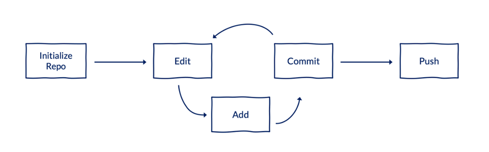
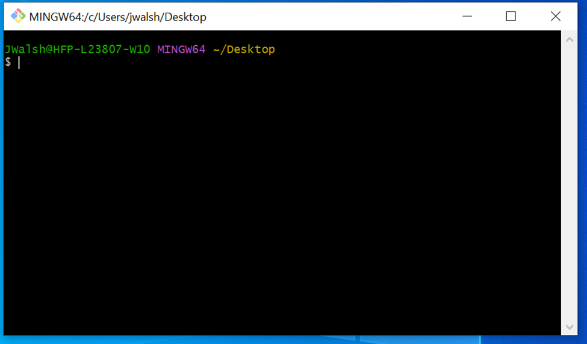
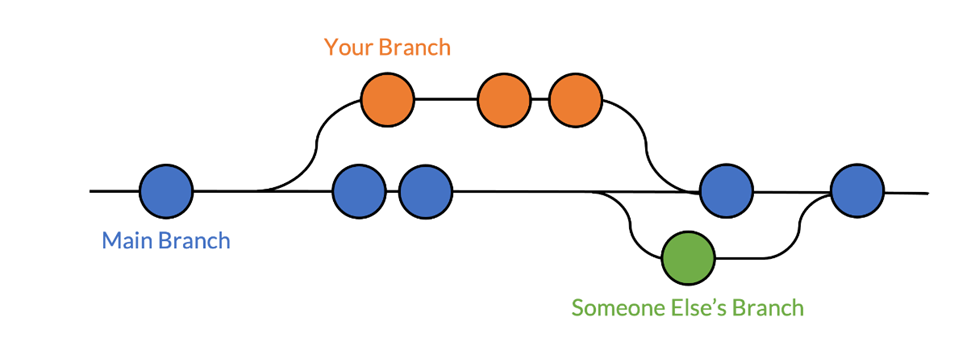
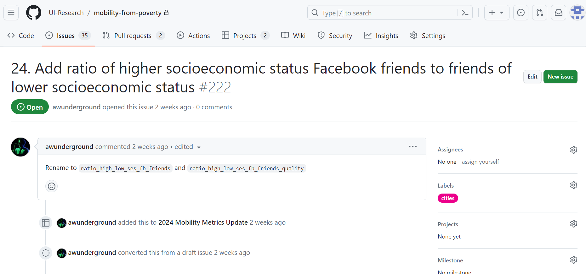
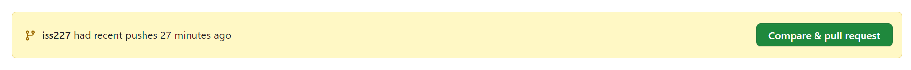
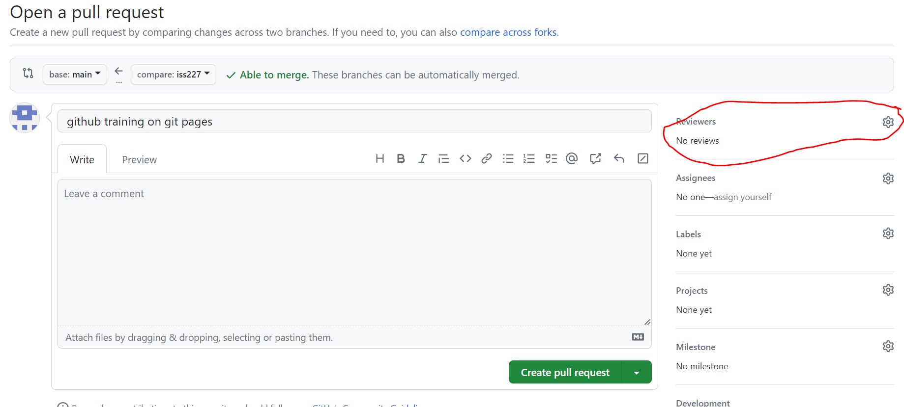

# **Git Training: Mobility Metrics Data Team**

## Part 1: Why git?

Version control is a system for managing and recording changes to files over time. Version control can:

-   Limit the chance of making a mistake
-   Maximize the chance of catching a mistake when it happens
-   Create a permanent record of changes to code
-   Easily undo mistakes by switching between iterations of code
-   Allow multiple paths of development while protecting working versions of code
-   Encourage communication between collaborators and is officially the process for Urban (learning this will help you with all your projects!)
-   Be used for external communication
-   Allows for a strong technical review process

**Git** is a distributed version-control system for tracking changes in code. Git is free, open-source software and can be used locally without an internet connection. It's like a turbo-charged version of track changes for code.

**GitHub** is an online hosting service for version control using Git. It also contains useful tools for collaboration and project management. It's like a turbo-charged version of Box for sharing repositories created using Git.

The objective of using Git and GitHub is to create local repositories that track code, and sometimes data, and then push those repositories to GitHub for back-up and collaboration. When someone else edits the code, they can push their changes to that repository.

*Note* anytime the characters "\<" and "\>" are used in this training around text inside of code chunks, that means it is a fill in the blank. Do not include these in your code if you are following along.

## Part 2: Confirm Git Access

We will now take some steps to ensure everyone has access to Git and Github. For those that are active users this will not apply to you and thanks for your patience!

### Check Configuration of Git and Github to account and email

To start, left click in any folder on your computer and select "Open Git Bash here". You should see the Git command prompt pop up. 

Now check if your account is properly configured with the following commands. First we can check if the correct email is synced with git bash.

```{bash}
git config --get user.email
```

Next, let's check if our GitHub account is synced by checking the username configured with Git.

```{bash}
git config --get user.name
```

After entering the above codes in GitBash, you should see you Github username and Urban email listed in the output.

If you do not see the correct account information you can configure using the following commands:

```{bash}
git config --global user.name "<your_github_username>"
git config --global user.email "<your_email_address>"
```

*If you are still having issues please see the Git and GitHub installation guide on the [mobility-from-poverty](https://github.com/UI-Research/mobility-from-poverty) GitHub page.*

## Part 3: Let's Git Down to Business: Mobility Metrics Git Workflow

We are going to walk through the use of Git in the creation of the Upward Mobility Framework mobility metrics.

#### Introduction to repository

**Repository:** A collection of files, often a directory, where files are organized and logged by Git. The repository for the Boosting Upward Mobility from Poverty project is [here](https://github.com/UI-Research/mobility-from-poverty). You all should be able to view this on GitHub currently.

Git and GitHub organize projects into repositories. Typically, a "repo" will correspond with the place where you started a .Rproj (in this case mobility-from-poverty.Rproj), if you are an R User, or where you keep the folders holding SAS and Stata programs.

When working with Git and GitHub on this project, your files will exist in two places: locally on your computer and remotely on GitHub.



*Command line*

You will interact with Git through the Git Bash command line we tested earlier. The number of Git commands you need to work in this project flow is very limited. There is a list of basic commands [here](https://ui-research.github.io/reproducibility-at-urban/git-workflow.html#summary-of-commands) but we will cover the key ones.



#### Cloning the main repository

This project already has an existing repository, so you do not have to create it. We will now clone the repo so everyone has it on their local computers. If you already have the repository cloned, we ask that you delete that folder and re-clone so that we know everyone is working from the same origin.

This only needs to happen once per repository per computer!

1.  On GitHub, navigate to the repo, and click the green button titled Code (top right corner). Copy the HTTPS remote URL. It will look like <https://github.com/UI-Research/mobility-from-poverty.git>
2.  Navigate to the directory where you want to keep the repo on your computer (we suggest using the C-drive on your local desktop). Left click and select Git Bash Here. Using the URL that you copied in the last step, clone the repository:

```{bash}
git clone https://github.com/UI-Research/mobility-from-poverty.git
```

#### Using Branches & Issues

You have now cloned the main "branch" of the repository to your local computer. This project uses multiple branches so that collaborators can update existing code or add new code without the fear of overwriting each others files. Branches let you say "Hey, I'm going to leave the main version of the code alone while I try some things out over here."



*Switching branches*

We will use the command `git checkout` to switch your local version to a new or existing branch. New branches will initially be identical to the local version of the main branch you just switched from.

```{bash}
#New branch
git checkout -b branch_name
#Existing branch
git checkout branch_name
```
For this round of updates we will be pushing primarily to the `version2024` branch which will be utilized as a staging space for the official main branch. To ensure you are working through this branch we will checkout to it before starting any work.

```{bash}
#Create the branch version2024 on your local repository 
git checkout -b version2024
```
*Git issues as branches*

Git issues is a feature of GitHub that allows you to track different tasks and changes. Below is an example of an issue from the mobility from poverty repository. There are currently [issues](https://github.com/UI-Research/mobility-from-poverty/issues) created for each metric update/change that need to be completed in the 2023-24 update.



For the workflow of this update cycle we will be using issues as branches. So when you are working on a particular metric you will create and utilize a branch with the same name as the issue connected to that metric. Using the example above, you can see that this is issue 222, so if we are just starting work on this issue we will create a new branch and title it `iss222`.

```{bash}
#New branch for issue 222
git checkout -b iss222
```

Note we checked out to this branch from the `version2024` branch - now when we push and commit our changes it will go to the `version2024` and not `main` branch.
One of the benefits of issues is that it helps keep the workflow organized, linking code changes with their original goal.

*Finding your current branch*

If you are not sure what branch you are working on `git branch` will tell you what branch you are currently on. It's always a good idea to run git branch before pushing. The code below should highlight in green the branch you are currently on.

```{bash}
git branch
```

*Practice*

*We created an issue in the upward mobility repository that we will use as a practice for the remaining part of this training. It is issue number 228. In your mobility metrics folders lets git bash and create this branch.*

```{bash}
git checkout -b iss228
```

Let's make sure we are on the right branch using the `git branch` command.

## Updating and Pushing Your Work

Now that we are on our practice branch, we are going to walk through the Git workflow.

The most common Git commands you will use while working on updates are *git status, git add, git commit, and git push*. These four commands will be 95% of your git workflow. These tell Git which files to track, when to take snapshots of those files, and when to send those snapshots to GitHub for others to see.

Once you have made updates to your code and it is ready for review you will go through the following steps. For the sake of practice, let's open a text file and save it to the main folder. Name it personalized to you "test_file\_\<your_name\>" and put whatever you want in it (maybe a little note saying how excited you are for this work).

A helpful function git status prints out important information about your repo. Use it before and after most commands to understand how files have changed in your repo.

```{bash}
git status
```

We can see that the added text file is shown in red text. This tells us it is a change from how we cloned the repo and has not yet been prepared to be merged with our main repo.

#### Adding and Committing

To prepare our new file for the main repo we use git add which adds a file to Git's staging area. It tells Git, "Hey, look at this file." After adding the text file, if we check git status again the test_file.txt will now appear in green.

```{bash}
git add test_file.txt
git status
```

Now that we have staged our file, we are ready to commit it. The command `git commit` commits changes made to added files to the repository. It says, "Hey, take a snapshot of the files I've added."

```{bash}
git commit -m "<message>"
```

Note: sometimes you may receive the message:

type :quit <Enter> to quit VIM

Please follow this [link](https://stackoverflow.com/questions/11828270/how-do-i-exit-vim) to see how you can resolve this issue.

#### Pushing Changes

We have now committed the changes and it's time to send them to the version2024 repository. The command git push pushes your local commits to the remote repository on GitHub. It says, "hey, push all my snapshots to a shared folder so that other people can see them." The command below will send your changes to the GitHub page under a new branch but will not immediately change the version2024 repository.

```{bash}
git push origin iss228
```

You will always follow up git push with "origin" and then the name of the branch you are working on ( in this case iss228).

Before running the git push command, your code and commits could only be accessed on your local computer. After pushing the code, it will appear on the main repo as a pull request that needs to be reviewed.

*Switching between branches*

If you are working on multiple issues you will likely want to be able to switch between branches. The easiest way to switch between branches without losing work is to `git commit` the changes you made prior to switching branches. If you try to change branches with untracked changes that are not committed generally Git will stop you.


*Oops! I forgot to switch branches and did a lot of work!*

This happens to the best of us. The steps for resolving are very similar to switching to a new branch but introduce a new command 'git stash'. When you have new work on a branch that is not committed you need to stash your changes before switching branches. This will save your changes locally so you can return to them.

```{bash}
#Stash changes
git stash
```

If you are moving back and forth between branches or plan to change branches multiple times before committing it can be helpful to name your stash. You can give a stash a name by using the following command:

```{bash}
#Stash changes
git stash push -m <"stashName">
```

After stashing you will be able to switch to a new branch without losing your work using the command described above. When you are ready to return to the branch you stashed, you take two steps

1.  Check out to the branch that you stashed work from.

2.  Once on the desired branch, you will use one of the commands below (depending on whether you named your stash or not).

```{bash}
#Retrive unnamed stash
git stash pop

#Retrive a named stash
git stash apply stash^{/<stashName>}
```

These will return the work you had done previously to the branch. However, note these changes will not be available to other project users or on Git Hub which requires pushing.

After you have successfully completed your stash apply you can delete the stashed information. 

```{bash}
#Retrive unnamed stash
git stash drop

```

*Other helpful commands:*

If you want to check what has been modified since the last commit you can use *git diff*. This will highlight which lines have been modified. Use the arrow keys to scroll, and press q if you need to exit the prompt.

```{bash}
git diff [filename] 
```

If you are like me, sometimes you will start working on the wrong branch or main branch. If you want to take the work that you have done and transition over to the correct branch you can use the code below.

```{bash}
git fetch
git checkout --track origin/<issue name>
```

## Reviewing Code

After changes are pushed from Git, GitHub via the mobility-from-poverty repository page, will show that a new pull request is ready.





After you submit work you should assign a reviewer (using the reviewers tab circled in red) to the pull request and create the pull request. This will notify that reviewer that your changes are ready to be looked at. There is more detail on using Git for review on the repostiory [ReadMe](https://github.com/UI-Research/mobility-from-poverty#boosting-upward-mobility-from-poverty).
